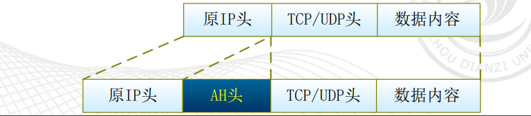
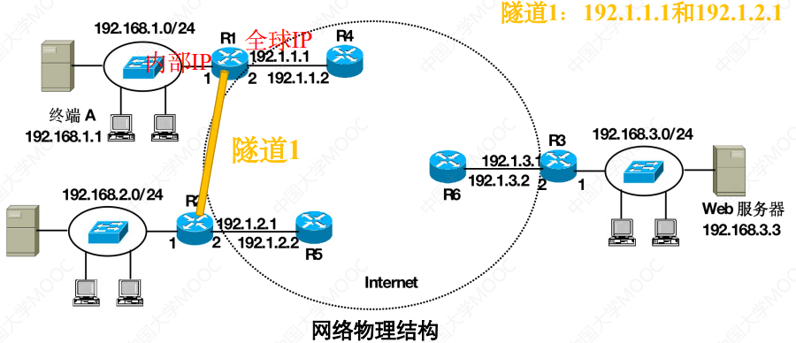
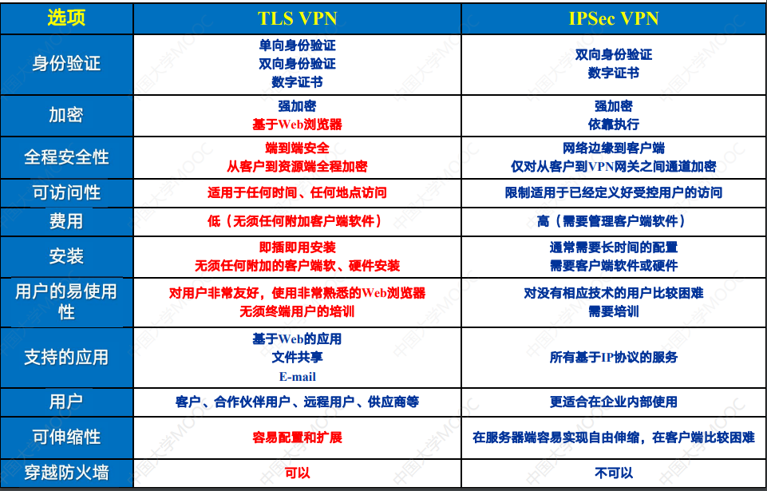

## 网络空间概论

**网络安全的目标**
- 保密性
- 完整性
- 可用性
- 不可抵赖性
- 可控性
或
**CIA安全模型**（Confidentiality，Integrity，Availability）
- 保密性
- 完整性
- 可用性

## 局域网攻击及防御技术

网络监控：
是针对局域网内的计算机进行监视和控制，针对内部的电脑在互联网上的活动（上网监控）以及非上网相关的内部行为与资产等过程管理（内网监控）

网络监控软件按照运行原理分类可分为：
1. 监听模式
2. 网关模式（大部分已经不用）

### 网络攻击的定义和分类

网络攻击的分类
- 被动攻击
	1. 嗅探攻击
	2. 非法访问
	3. 数据流分析
- 主动攻击
	1. 篡改信息
	2. 欺骗攻击
	3. 拒绝服务攻击
	4. 重放攻击

### 窃听攻击

交换机的原理：
通过MAC表来记录端口和转发MAC地址的对应关系
攻击：
1. 交换机MAC表溢出：通过不断的发送不同的MAC为源的帧，来占用MAC表
2. 交换机端口镜像
防护：
1. 防止黑客接入集线器
2. 防止黑客接入交换机

MAC表溢出解决方案：
MAC表溢出的直接原因：交换机接收到太多源MAC地址不同的MAC帧
解决思路：限制每个端口允许接收的源MAC地址不同的MAC帧的数量

### 截获攻击

- **MAC地址欺骗攻击**
	**攻击流程**：
		黑客接入以太网，修改自己的MAC地址为攻击对象的MAC地址，然后发送广播修改交换机的MAC表
	**防御**：
		1. 阻止黑客连入以太网
		2. 通过交换机端口安全配置

- **DHCP欺骗攻击**
	**攻击流程**：
		黑客伪造一个DHCP服务器，通过这个DHCP服务器将黑客的终端作为默认网关地址
	**防御**:
		只有在信任端口的DHCP服务器才能为终端提供自动配网服务

- **ARP欺骗攻击**
	**攻击流程**：
		黑客发送被攻击者的IP地址和自己的MAC地址的ARP请求报文，然后可以接收所有以被攻击者IP地址为目的的包
	**防御**：
		交换机中建立正确的MAC地址与IP地址之间的绑定关系

- **生成树欺骗攻击**
	生成树协议是为了有环形拓扑的时候，避免在环形拓扑中的广播风暴
	**攻击流程**：
		黑客接入伪造的交换机，并配置交换机的优先级，使得信息经过他所连接的端口
	**防御**：
		不允许黑客终端参与网络生成树的建立过程，即只在用于实现两个认证交换机之间互联的交换机端口启动生成树协议（交换机设置BPDU防护端口）

### 欺骗攻击

- **源IP地址欺骗**
	**原理**：
		不以真实的IP地址作为源IP地址，而是伪造一个IP地址作为源IP地址
	**防御**：
		网络接到IP分组时，先判别该IP分组的源IP地址是否与发送该IP分组的终端的IP地址一致，如果不一致，则不转发

- **钓鱼网站**
	**攻击流程**：
		1. hosts文件劫持
		2. 假域名服务器（DNS服务器）
	**防御**：
		1. 只允许经过认证的DHCP服务器接入以太网
		2. 证实Web服务器身份后，才对Web服务器进行访问

## 密码学算法

基本术语：
1. 发送者
2. 接收者
3. 攻击者
4. 加密变换
5. 解密变换
6. 密钥器

古典密码：
1. 凯撒密码（移几位）
2. Vigenere密码：一系列的凯撒密码
3. hill密码：矩阵加密
4. 置换密码（根据密钥换位置）

**现代密码算法**
**Kerckhoff's原则**：所有加密解密算法都是公开的，保密的只是密钥

- **对称密码体制**
	序列密码算法：**RC4**
		1. 用Key生成S盒
		2. 用盒生成密钥流
	分组加密算法：**DES**，**SM4**，SM1，SM7
		混淆（confusion）和扩散（diffusion）
		
- **非对称密码体制**
	基于因子分解难题：**RSA**，**SM2**，SM9
	基于离散对数难题：**ECC**
- **消息摘要算法**
	**MD5**，SHA1，SHA256，**SM3**
- **密钥交换算法**
	**Diffle-Hellman**

### 认证技术

- 消息认证码
	MAC：MAC = Ck(M)
	1. 直接算出MAC，然后和明文合在一起发给对方
	2. 算出MAC，然后和明文合在一起加密后发给对方
	3. 将明文加密，算出MAC，然后合在一起发给对方
	  作用：
	  1. 收方可以验证发送方的身份是否被篡改
	  2. 收方可以验证发送方的内容是否被篡改
- 数字签名
	- 公钥
	- 私钥
	作用：
	- 不可否认
	数字签名+加密算法：
	
- PKI（公钥基础设施 public key infrastructure）
	以数字证书为基础，注册授权中心RA，认证授权中心CA
	根CA，可信CA
	

## 网络安全协议

**原因**：（TCP/IP存在的问题）
1. 源端鉴别问题
2. 保密问题
3. 完整性问题
4. 身份鉴别问题

- **TLS**（SSL3.0）
	1. TLS握手协议（应用层）
	2. TLS密钥交换协议（应用层）
	3. TLS报警协议（应用层）
	4. TLS记录协议（应用层和传输层之间）
		- **TLS握手协议**：服务器和客户端可以协商加密算法、MAC算法、保密密钥
			1. 建立安全能力
			2. 服务器鉴别和密钥交换
			3. 客户鉴别和密钥交换
			4. 完成握手协议
			  真实的TLS建立过程：
			  1. Client Hello（告诉服务器有什么加密套件）
			  2. Server Hello（选择加密套件）
			  3. CertificateServer（发送服务器的证书）
			  4. Client key exchange（得出共享密钥）
			  5. Finish（完成握手）
			     一般需要2个RTT
		- **TLS密钥交换协议**：负责更新用于当前连接的密码组
		- **TLS报警协议**：用来为对等实体传递TLS的相关警告
		- **TLS记录协议**：
			1. 将数据分块
			2. 数据压缩
			3. 利用MAC
			4. 利用加密算法加密
			5. 添加首部
- **IPSEC**
	IPSec网关可以对IP数据包只进行加密或认证， 也可以对数据包同时实施加密和认证。
	1. 认证头标AH（认证）
	2. 封装安全净载ESP（保密）
	两种安全协议都有传输模式和隧道模式
		1. 传输模式用在点对点的通讯
		2. 隧道模式用在站点对站点的通讯
	- AH
		1. 传输模式
		
		2. 隧道模式
		
	- ESP
		1. 传输模式
		
		2. 隧道模式
		
	同时两者加密的策略基于SA的具体内容
		IKE（Internet Key Exchange）
			用于建立和协商SA以及管理密钥
			1. 第一阶段，建立SA保护IKE的协商
			2. 第二阶段，建立SA保护实际的数据传输
		SA（Secutity Association）
			双方同信数据所协商的一组数据，SA是单向的，通常需要两个SA来保护双向通信
			1. 加密算法
			2. 会话密钥
			3. 数据流的特定信息（例如源地址、目标地址、协议类型）

## 无线局域网安全技术

### WEP（有线等效保密协议）
WEP加密过程

WEP解密和完整性检测过程

需要关注的问题：
	1. IV：24位
	2. 密钥：40位或104位
	3. 随机数种子：64位或128位
	4. CRC：32位
	5. 一次性密钥：64位或128位
	发送者发送的是：IV和加密后的数据
	每次变一下IV是：为了防止重放攻击和提高安全性
WEP鉴别机制：
	AP（Access Point）发送一个challenge，终端通过发送加密后密文给AP从而得到AP的认证
WEP存在的缺陷：

1. 所有终端共享相同的密钥，静态配置
2. challenge和IV是明文传输的
3. IV只有24位
4. CRC的漏洞

### 802.11i
加密机制：
1. TKIP
2. CCMP
优点：
1. 密钥基于用户配置，动态配置
2. 使用加密的消息鉴别码MAC
3. 双向鉴别机制

### 802.1x
特点：
1. 基于用户身份认证，不是基于终端
2. 在建立安全关联时分配临时密钥TK，TK只在安全关联存在期间有效

### WPA
基于802.11i
与WEP的对比

## Web攻击

### SQL注入
按变量类型：
- 数字型
- 字符型

按提交方式：
- get
- post
- cookie

盲注：
- 布尔盲注（是否加载）
- 时间盲注（加载时间不同）
- 错误盲注（返回数据库报错）

### XSS跨站脚本攻击
- 反射型XSS攻击（黑客把恶意链接发给被攻击者）
	经过后端，不经过数据库
	数据流向：浏览器->后端->浏览器
- 存储型XSS攻击（黑客把恶意代码发给服务器）
	经过后端，经过数据库
	数据流向：浏览器->后端->数据库->浏览器
- DOM-based型XSS攻击（黑客把恶意链接发给被攻击者）
	不经过后端
	数据流向：URL->浏览器

### CSRF跨站请求伪造攻击
Cross-site request forgery
1. 登录受信任网站A，并在本地生成Cookie。
2. 在不登出A的情况下，访问危险网站B。

### 文件上传漏洞
将恶意代码文件上传至服务器
条件：
- 文件可上传 
- 知道文件上传的路径 
- 上传文件可以被访问 
- 上传文件可以被执行

## 恶意代码
恶意代码的特征：
- 非授权性
- 破坏性
- 潜伏性
- 传染性
- 依附性

恶意代码的生命周期：
1. 编制代码
2. 传播
3. 感染
4. 触发
5. 运行

命名规则：
<病毒前缀>.<病毒名>.<病毒后缀>
前缀是种类：Trojan，Worm
病毒名是家族特征
病毒后缀是变种特征

- 狭义病毒
- 蠕虫病毒
- 木马病毒
- 勒索病毒

检测手段：
- 基于主机的检测方法
	- 静态检测（拓展名、数据的熵、蜜罐文件）
	- 动态检测（沙盒、API调用、流量分析）
- 基于网络的检测方法

## 防火墙

utm和防火墙的比较

过滤规则：
- 源IP地址
- 目标IP地址
- 源和目的端口号（HTTP 80，HTTPS 443，FTP 20/21，SSH 22，SMTP 25，IMAP 143，DNS 53 DHCP 67/68）
- 协议类型（TCP、UDP）

- 静态包过滤
- 动态包过滤（状态感知）

防火墙的部署
- 内部防火墙
- 边界防火墙（和DMZ区域，Internet区域连接）

缺陷和发展趋势：
1. 无法识别复杂的威胁
2. 无法防范内部攻击
3. 易被绕过
4. 管理复杂

1. 集成深度分析技术
2. 下一代防火墙
3. 零信任架构
4. 自动化和智能化
5. 云防火墙

## 互联网安全技术

### 安全路由
路由器欺骗攻击：黑客发送伪造的与另一个网络直连的路由项，改变路由表
防御：
1. 路由项源端鉴别和完整性检测
2. 路由项过滤
3. 单播反向路径验证
4. 策略路由

### 流量管制
拒绝服务攻击
- SYN泛洪攻击
	防御：防止伪造源IP地址的IP分组传输
- Smurf攻击（攻击者的源IP  + 普通终端的目的IP（广播））
	防御：防止伪造源IP地址的IP分组传输；路由器阻止以广播地址位目的IP的IP分组的转发
- DDos攻击
	减少肉鸡；流量管制
	**流量管制**：
		是一种将属于特定应用的IP分组的传输速率限定在某个设定值的技术
		1. 漏斗管制法（输出恒速，多的包丢弃）
		2. 令牌桶算法
		

### NAT
原因：IPv4地址危机
私有地址： 10.0.0.0 - 10.255.255.255、172.16.0.0 - 172.31.255.255、192.168.0.0 - 192.168.255.255
- 静态NAT
	内部地址和外部地址可以一对一的转换
- 动态NAT
	公有IP构成一个IP地址池，主机访问外网时，分配地址
- 静态PAT
	多台主机用不同端口使用同一个公有IP
- 动态PAT
	公有IP构成一个IP地址池，主机访问外网时，用一个端口分配到一个IP

### VRRP
虚拟路由器冗余协议
虚拟路由器：将多台路由器组成一台虚拟路由器
主路由器：正在执行转发的路由器；备份路由器：没有任务
VRID：虚拟路由器的标识
虚拟IP地址：虚拟路由器的IP
虚拟MAC地址：根据VRID生成的虚拟MAC地址（00-00-5E-00-01/02-{VRID}）
抢占模式：如果backup设备优先级高，直接切换成master；非抢占模式：只要master不故障就不更换
两种模式：
1. 主备备份模式：只有一个路由器在工作
2. 负载均衡模式：多个路由器，同时存在多个虚拟路由器分担负载

## VPN
原有问题：
- SDH（专线）贵
- PSTN（公共交换电话网）贵、慢
优势：
- 加密数据
- 消息认证和身份认证
- 提供访问控制
隧道协议（47）
1. 第三层隧道VPN(IPSec)
	
	
2. 第二层隧道VPN
	1. 终端和路由器之间建立第二层隧道
	2. 基于第二次隧道建立PPP链路
	3. 完成身份验证
	4. 给终端分配私有IP地址
3. TLS/SSL VPN
	原有问题：
		1. VPN对远程终端访问权限没有限制
		2. 无法实现基于用户授权
		3. 要安装专用客户端
	访问SSL VPN网关（HTTPS访问）来访问内部网络

## 入侵检测系统
IDS（Intrusion Detection On System）
按照数据来源分类：
- NIDS（基于网络，截获数据包，提取特征比较）
- HIDS（基于主机，通过日志的监控分析）
- DIDS（分布式，同时分析数据和日志）
按照检测策略分类：
- 误用检测
- 异常检测
- 完整性检测
IDS的部署

发展方向：
1. 高速
2. 分布式
3. 数据挖掘
4. 实时
5. 先进的算法